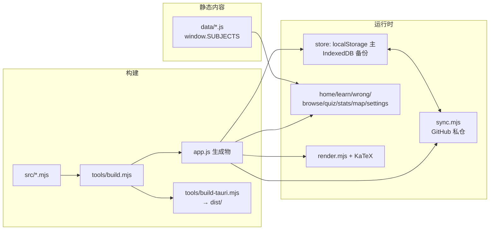

# ARCHITECTURE — 模块与数据流

> 配合 `AGENTS.md` 使用。字段/卡面约定见 `DATA_SCHEMA.md`，协作纪律见 `WORKFLOW.md`。

## 总览

- **零 npm 运行时依赖**：浏览器直接加载 `index.html` → `data/*.js` → `app.js`。
- **源码拼接**：`src/*.mjs` 不是 ESM 运行单元，而是 IIFE 内片段；带 `export` 的纯函数模块在拼接时剥离 `export` 行（见 `tools/build.mjs` 的 `stripExports`），以便 `tests/*.mjs` 以 ESM 方式单独 import 对拍。
- **生成物**：`app.js`、`CHANGELOG.md`、`dist/` 不可手改。

## `src/` 拼接顺序（`tools/build.mjs` `ORDER`）

| # | 模块 | 职责 |
|---|---|---|
| 1 | `config.mjs` | 全局常量：`GOAL_DEFAULT` / `TARGET_S_DEFAULT` / `DAY` / `dayStart`（须最先） |
| 2 | `app.mjs` | IIFE 开头、`VERSION`、`CHANGELOG` 数组、`bootKatex` / `splitPoints` |
| 3 | `fsrs-core.mjs` | FSRS-6 公式层：权重 `FW`、R(t,S)、间隔、D/S 更新（export 供对拍） |
| 4 | `sched.mjs` | 学习/重学/复习步进状态机 `applySchedRating`（知识卡；export） |
| 5 | `interleave.mjs` | 交错/辨析聚类 `interleaveRelated`（export） |
| 6 | `store.mjs` | 学科切换、DB 读写、sanitize、导入导出、自建卡/覆盖 |
| 7 | `render.mjs` | `renderTex` / `renderProse` / KaTeX 与代码块 `~~~` |
| 8 | `learn.mjs` | **共享学习核心**（文件名易误导）：会话键、掌握度/毕业、评分 `applyRating`、记忆模块 `memoryBox`、`renderApp`/`renderSubnav`/`renderDock` 壳层 |
| 9 | `browse.mjs` | **知识卡学习页 + 卡面编辑**（易误导）：`buildSession`/`renderLearn`/`renderLearnCard`/`doRate`、内置卡编辑弹窗 |
| 10 | `wrong.mjs` | 错题本（录入、重做、浏览、统计）；错题调度 export |
| 11 | `quiz.mjs` | **帮助 + 浏览列表 + 自测**（易误导）：`renderHelp` / `renderBrowse` / `renderQuiz` |
| 12 | `settings.mjs` | 设置、初学者章节、更新日志 UI |
| 13 | `stats.mjs` | 统计、负载预测、考试日展望（export） |
| 14 | `map.mjs` | 原理页 + 知识图谱 |
| 15 | `home.mjs` | 主页 KPI、学科网格、每日一句 |
| 16 | `sync.mjs` | GitHub 云同步合并 `mergeDb`/`runSync`（export） |
| 17 | `actions.mjs` | 事件总线 `handleAction`、主题/抽屉/学科下拉、导入导出、`initApp`；键盘刷卡：Space/Enter 显示答案、1-4 评分、←/→ 切卡（learn→goback/gofront，wrong→wgoback/wgofront，输入框焦点不触发） |

**文件名 ≠ 职责**（历史命名）：改知识卡学习 UI 去 `browse.mjs`；改掌握度/评分入口/应用壳层去 `learn.mjs`；改浏览列表或帮助或自测去 `quiz.mjs`。找错文件是本仓最常见的浪费。

`stripExports`（拼接时去掉 `export`，便于 tests 以 ESM 导入）：`fsrs-core` `interleave` `sched` `wrong` `sync` `stats`。

改顺序或增删模块时，必须同步：`tools/build.mjs` `ORDER`、`stripExports` 列表（若需测试导出）、以及本文表格。

## 内容加载

`index.html` 按固定列表加载 25 个 `data/*.js`（`math3`…`wujing`，全清单见 `DATA_SCHEMA.md`），最后加载 `app.js`。每个数据文件写入 `window.SUBJECTS.<id>`。

- `store.setSubject(id)` 切换当前科：绑定 `CATS` / `DATA` / `META` / `EXAMPLE` / `REL` / …，写 `localStorage` 记住上次科目。
- `refreshData()` 把静态卡 + 用户覆盖（`cardOverrides`，可 hidden）+ 自建卡（`custom`）合成当前展示用 `DATA`；`archived` 卡与孤儿 id 会被排除/清理。

## 存储

| 键 | 内容 |
|---|---|
| `<subjId>_formula_srs_v1` | 该科学习库 DB（主存 localStorage） |
| `<subjId>_formula_session_v2` | 学习会话（队列游标等） |
| `ms3_formula_theme` | 明暗主题 |

IndexedDB `kv` 作为同 key 备份；加载时 `localStorage` 优先，缺失则回退 IDB。写入走 `saveDB` → 100ms 合并 `flushSave`。规范化（`normalizeDB`）会补默认字段、拒收 NaN、修远期 due、删孤儿卡，并以 `saveDB(true)` 回写（**不**刷新 `updatedAt`，避免污染云同步新旧判断）。

## 云同步（`sync.mjs`）

- 通道：用户 GitHub 私仓 `athena-sync/` 目录，明文 JSON。
- 启动拉取；评分落盘约 30s 后防抖上传；回前台超 5 分钟自动同步。
- **合并**：卡片/错题并集，同卡比 `lastR` 等选边；日志逐日取大/取或；自定义内容冲突本地优先；设置本地优先；覆盖前只在「对侧有本机未见变化」时归档（`archive/` 每科保留最近 10 份）。
- 同一设备同步请求串行；PUT 遇 409 自动重拉合并重试。

## 调度（勿与 FSRS 公式层混淆）

- **公式层** `fsrs-core.mjs`：对齐 FSRS-6 官方，无自创封顶。
- **状态机** `sched.mjs`：Anki 式学习步进（分钟级 steps）+ 复习阶段 FSRS 更新。四档：0 Again / 1 Hard / 2 Good / 3 Easy → G=1..4。
- **毕业/掌握度**：稳定度 S 对目标 `targetS` 的对数压缩（自创展示指标，标 ⚠️）。
- **错题卡** `wrong.mjs`：v1.16.0 起纯复习态 FSRS（添加即视为当日遗忘）；失败可降级关联知识卡。

## 校验闸门

| 工具 | 拦什么 | 何时 |
|---|---|---|
| `build.mjs --check` | `app.js` 与 `src/` 不同步 | CI / 提交前 |
| `check_data.mjs` | 重复 id、REL/META/EXAMPLE 断裂、非法 cat、id 泄漏、`**`/`$` 未闭合 | 改 `data/` |
| `check_render.mjs` | 真实 KaTeX 渲染后 katex-error / 残留命令 / 字面 `**` | 改 data 或 render |
| `check_version.mjs` | 版本七处一致 | 升版 |
| `changelog.mjs --check` | `CHANGELOG.md` 与 `src/app.mjs` 同步 | 改日志 |
| `node --test tests/…` | FSRS 对拍、交错、调度状态机、错题、同步、预测 | 改调度/同步 |

CI（`.github/workflows/ci.yml`）= 上述闸门的无渲染子集。

## 桌面版

`tools/build-tauri.mjs` 把静态前端同步到 `dist/`；`src-tauri` WebView 加载 `dist/index.html`。细节见 `docs/DESKTOP.md`。`frontendDist` 为 `../dist`，不是仓库根。
