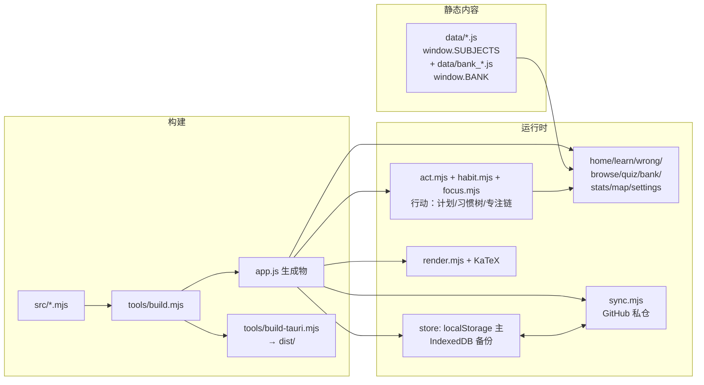

# ARCHITECTURE — 模块与数据流

> 配合 `AGENTS.md` 使用。字段/卡面约定见 `DATA_SCHEMA.md`，协作纪律见 `WORKFLOW.md`。

## 总览

```mermaid
flowchart LR
  subgraph 静态内容
    D["data/*.js\nwindow.SUBJECTS\n+ data/bank_*.js\nwindow.BANK"]
  end
  subgraph 构建
    B["tools/build.mjs"]
    S["src/*.mjs"]
    A["app.js 生成物"]
    T["tools/build-tauri.mjs\n→ dist/"]
    S --> B --> A
    B --> T
  end
  subgraph 运行时
    A --> ST["store: localStorage 主\nIndexedDB 备份"]
    A --> UI["home/learn/wrong/\nbrowse/quiz/bank/\nstats/map/settings"]
    A --> ACT["act.mjs + habit.mjs + focus.mjs\n行动：计划/习惯树/专注链"]
    A --> SY["sync.mjs\nGitHub 私仓"]
    A --> R["render.mjs + KaTeX"]
  end
  D --> UI
  ST <--> SY
  ACT --> UI
```

- **零 npm 运行时依赖**：浏览器直接加载 `index.html` → `data/*.js` → `app.js`。
- **源码拼接**：`src/*.mjs` 不是 ESM 运行单元，而是 IIFE 内片段；带 `export` 的纯函数模块在拼接时剥离 `export` 行（见 `tools/build.mjs` 的 `stripExports`），以便 `tests/*.mjs` 以 ESM 方式单独 import 对拍。
- **构建工具契约**：`tools/build.mjs` 是纯函数模块（`buildProduct` / `buildBody` / `runCli`），`import` 它零副作用，仅在做主模块时执行 CLI（`invokedDirectly` 守卫）；`tests/build.test.mjs` 因此可直接 import 拼装逻辑做对拍。
- **生成物**：`app.js`、`CHANGELOG.md`、`dist/` 不可手改。
- **行动模块规格**：`docs/ACT.md`（WOOP 主干计划 / 习惯树 / 专注链 / 过程反馈红线）。

## 设计系统（2.0 · 自 V2_PLAN 内化）

| Token | 亮色 | 用途 |
|---|---|---|
| `--bg` / `--bg-elevated` / `--bg-sunken` | `#F7F8FA` / `#FFF` / `#EEF0F3` | 层级 |
| `--accent` / `--accent-2` | `#3B82F6` 蓝 / `#D4537E` 粉 | 学习 / 行动·里程碑 |
| 字体 | 系统栈 + PingFang SC（`fonts/inter-*.woff2` 拉丁） | UI 13–14 / 正文 15 |

布局：桌面左侧栏；iOS 底栏 + safe-area；Today 双栏；`Ctrl/⌘+K` 命令面板。空态插画 `assets/empty-*.webp`。

## `src/` 拼接顺序（`tools/build.mjs` `ORDER`）

| # | 模块 | 职责 |
|---|---|---|
| 1 | `config.mjs` | 全局常量：`GOAL_DEFAULT` / `TARGET_S_DEFAULT` / `DAY` / `dayStart`（须最先） |
| 2 | `app.mjs` | IIFE 开头、`VERSION`、`CHANGELOG` 数组、`bootKatex` / `splitAnswerBlocks`（卡面分段） |
| 3 | `fsrs-core.mjs` | FSRS-6 公式层：权重 `FW`、R(t,S)、间隔、D/S 更新（export 供对拍） |
| 4 | `sched.mjs` | 学习/重学/复习步进状态机 `applySchedRating`（知识卡；export） |
| 5 | `interleave.mjs` | 交错/辨析聚类 `interleaveRelated`（export） |
| 6 | `store.mjs` | 学科切换、DB 读写、sanitize、导入导出、自建卡/覆盖 |
| 7 | `render.mjs` | `renderTex` / `renderProse` / KaTeX 与代码块 `~~~` |
| 8 | `learn.mjs` | **共享学习核心**（文件名易误导）：会话键、掌握度/毕业、评分 `applyRating`、记忆模块 `memoryBox`、`renderApp`/`renderSubnav`/`renderDock` 壳层 |
| 9 | `browse.mjs` | **知识卡学习页 + 卡面编辑**（易误导）：`buildSession`/`renderLearn`/`renderLearnCard`/`doRate`、内置卡编辑弹窗 |
| 10 | `wrong.mjs` | 错题本（录入、重做、浏览、统计）；错题调度 export |
| 11 | `quiz.mjs` | **帮助 + 浏览列表 + 自测**（易误导）：`renderHelp` / `renderBrowse` / `renderQuiz` |
| 12 | `bank.mjs` | **题库 POC**：真题浏览（范围恒等于全局学科选择器；题型/知识点/难度（≥）三组 `select` + 关键字筛选）与详情、徽标「院校 · 年度 · 题号」、一键入错题；数据读 `window.BANK.<subj>`（export 纯函数 `bank*`） |
| 13 | `settings.mjs` | 设置、初学者章节、更新日志 UI |
| 14 | `stats.mjs` | 统计、负载预测、考试日展望（export） |
| 15 | `map.mjs` | 原理页（学习科学 + 认知科学）+ 知识图谱 |
| 16 | `home.mjs` | **Today 主页**：双栏（左今日复习 due / 右习惯·专注摘要）、里程碑 1 条、快捷入口、学科网格、每日精选 |
| 17 | `sync.mjs` | GitHub 云同步合并 `mergeDb`/`runSync`（export） |
| 18 | `act.mjs` | **行动·计划**：WOOP 主干（P=如果-那么，外部提示并入障碍）、RSIP 设计手册帮助（export 纯校验可测） |
| 19 | `habit.mjs` | **行动·习惯树**：RSIP 层级/每日检查/组 minK/内化/强化（export `evaluateHabitDay` 等） |
| 20 | `focus.mjs` | **行动·专注链**：CTDP 神圣座位 `#N`/下必为例/预约 15 分/侦查/继位；四级（unit→group→corps→army）严格逐级归属、番号最小空缺复用、层级视觉与悬浮提醒（export 纯函数） |
| 21 | `mile.mjs` | **行动·里程碑**：条件 + 解锁时间 +「这说明…」+ 深链；Def 是代码常量、Hit 记录进云（export 纯函数） |
| 22 | `actions.mjs` | 事件总线 `handleAction`、主题/抽屉/学科下拉、导入导出、`initApp`；键盘刷卡：Space/Enter 显示答案、1-4 评分、←/→ 切卡（learn→goback/gofront，wrong→wgoback/wgofront，输入框焦点不触发） |

**文件名 ≠ 职责**（历史命名）：改知识卡学习 UI 去 `browse.mjs`；改掌握度/评分入口/应用壳层去 `learn.mjs`；改浏览列表或帮助或自测去 `quiz.mjs`；改题库（真题筛选/详情/入错题）去 `bank.mjs`。找错文件是本仓最常见的浪费。

`stripExports`（拼接时去掉 `export`，便于 tests 以 ESM 导入）：`fsrs-core` `interleave` `sched` `store` `wrong` `sync` `stats` `act` `habit` `focus` `mile` `bank`（共 12 项）。

改顺序或增删模块时，必须同步：`tools/build.mjs` `ORDER`、`stripExports` 列表（若需测试导出）、以及本文表格。

**漏登记的后果（2.1.0 的真实起因）**：新模块若只加文件、不登记进 `ORDER`，产物里就缺这段代码；若登记了 `ORDER` 却漏进 `stripExports`，产物里会**残留顶层 `export` 行**——浏览器按普通脚本解析时直接 `SyntaxError`，整站白屏（`app.js` 是普通 `<script>`，不是 `type="module"`）。所以「新增模块」= 文件 + `ORDER` + `stripExports` + 本文表格 + `index.html`（若是数据文件）四处同改。

## 内容加载

`index.html` 按固定列表加载 25 个 `data/*.js`（`math3`…`wujing`，全清单见 `DATA_SCHEMA.md`），最后加载 `app.js`。每个数据文件写入 `window.SUBJECTS.<id>`。

- **题库数据另成一套**：`index.html:131-133` 在 `app.js` 之前追加 `data/bank_math3.js` / `data/bank_econ.js` / `data/bank_stats.js`，各自写入 `window.BANK.<subj>`（与 `window.SUBJECTS.<id>` 并列，互不污染；形状见 `DATA_SCHEMA.md`）。这三个文件同时在 `sw.js:41-43` 的预缓存清单里——新增题库文件要**两处同改**（`index.html` + `sw.js`）。
- `store.setSubject(id)` 切换当前科：绑定 `CATS` / `DATA` / `META` / `EXAMPLE` / `REL` / …，写 `localStorage` 记住上次科目。
- `refreshData()` 把静态卡 + 用户覆盖（`cardOverrides`，可 hidden）+ 自建卡（`custom`）合成当前展示用 `DATA`；`archived` 卡与孤儿 id 会被排除/清理。

## 存储

| 键 | 内容 |
|---|---|
| `<subjId>_formula_srs_v1` | 该科学习库 DB（主存 localStorage） |
| `<subjId>_formula_session_v2` | 学习会话（队列游标等） |
| `ms3_formula_theme` | 明暗主题 |
| `athena_act_v1` | 行动·计划 + 习惯节点（WOOP / habits；旧 ifThen/envAudit 丢弃；见 `ACT.md`；**独立于学习库**） |
| `athena_habit_groups_v1` | 习惯树组配置（minK 等；与学习库、act 隔离，避免被 `actSanitize` 剥掉） |
| `athena_focus_v1` | 专注链 CTDP 状态（链/判例/预约；与学习库及 `athena_act_v1` 隔离） |
| `athena_mile_v1` | 里程碑 Hit 记录（`MILE_KEY`；Def 是 `mile.mjs` 的代码常量，不入存储、不入云） |

**键隔离红线**：`athena_act_v1` / `athena_habit_groups_v1` / `athena_focus_v1` / `athena_mile_v1` 一律**不得**写入 `*_formula_srs_v1`（云同步、导入导出亦只认学习库键）。

IndexedDB `kv` 作为同 key 备份；加载时 `localStorage` 优先，缺失则回退 IDB。写入走 `saveDB` → 100ms 合并 `flushSave`。规范化（`normalizeDB`）会补默认字段、拒收 NaN、修远期 due、删孤儿卡，并以 `saveDB(true)` 回写（**不**刷新 `updatedAt`，避免污染云同步新旧判断）。

## 云同步（`sync.mjs`）

- 通道：用户 GitHub 私仓 `athena-sync/` 目录，明文 JSON。
- 启动拉取；评分落盘约 30s 后防抖上传；回前台超 5 分钟自动同步。
- **合并**：卡片/错题并集，同卡比 `lastR` 等选边；日志逐日取大/取或；自定义内容冲突本地优先；设置本地优先；覆盖前只在「对侧有本机未见变化」时归档（`archive/` 每科保留最近 10 份）。
- **自测记录**（`log.quiz`）：按 `t` 去重并集（本地在前 → 同 `t` 以本地记录为准）、`t` 升序、超上限只留最新（`SYNC_QUIZ_MAX = 200`）；合并不推进 `updatedAt`（去重键是时间戳，不是计数器）。
- **畸形载荷防御**：`mergeDb` 起手用 `syncSafeMap` / `syncSafeList` 把「非对象 / 非数组」的容器降级为空对象 / 空数组，按「该侧没有这段数据」继续合并，不因 `TypeError` 中断整条同步链路（修复后 `out.log.revlogs` 恒为数组）。口径是**只守外层容器、不深度净化日值**：曾尝试净化 `counts` 日值，会把 `counts: { d2: 4 }` 洗成 `{}`，已回退。
- **行动模块**（`athena-sync/data/_act.json`）：载荷 `{ act, habitGroups, focus, mile, settings }` 一并同步（`runSync` / `forceUploadAll` / `forceDownloadAll` 三条路径共用同一组装/写回漏斗）；里程碑只同步 Hit 记录（`defId` 去重、同 `defId` 取 `at` 较新并集），Def 是代码常量不入云；老云端载荷无 `mile` 字段按空结构 `{ hits: [] }` 处理。
- 同一设备同步请求串行；PUT 遇 409 自动重拉合并重试。

## 调度（勿与 FSRS 公式层混淆）

- **公式层** `fsrs-core.mjs`：对齐 FSRS-6 官方，无自创封顶。
- **状态机** `sched.mjs`：Anki 式学习步进（分钟级 steps）+ 复习阶段 FSRS 更新。四档：0 Again / 1 Hard / 2 Good / 3 Easy → G=1..4。
- **毕业/掌握度**：稳定度 S 对目标 `targetS` 的对数压缩（自创展示指标，标 ⚠️）。
- **提前复习接口** `sched.mjs` 的 `markCardDueNow(c, now)`：只把到期时间移到「现在」、**不动记忆历史**（export 供对拍；自测入队与浏览页「立即重学」都走它）。
- **错题卡** `wrong.mjs`：v1.16.0 起纯复习态 FSRS（添加即视为当日遗忘）；失败可降级关联知识卡（受 `linkedMastery` 开关约束，见下）。

### 错题卡 ↔ 知识点联动（`linkedMastery`）

- 字段：错题卡 `linkedMastery`（`store.mjs` `defaultWrongCard()` 默认 **1**；`sanitizeWrongCard` 只在显式 `=== 0` 时保留 0，其余一律收敛为 1）。语义：`1` = 错题评分影响关联知识卡掌握度；`0` = 只按错题卡自身调度，**不**改关联知识点。
- 例题来源自动为 `0`：`wrong.mjs` 的 `markAsWrong(ex, linkedId)` 写 `w.linkedMastery = 0`（例题只看自己）；手动录入的错题（`saveWrongInput`）保持 `1`，行为与既往一致。
- 降级发生在 `demoteLinked(w, rating)`，由 `doWrongRate` 在 `r <= 1`（Again/Hard）时调用；三道早退：`linkedMastery === 0`、无 `linked` 关联、`rating > 1`。
- **旧数据缺字段按 1 处理**（历史得降级行为不回滚）；整卡透传，云同步/导入导出不做字段级改写。

## 自测（`quiz.mjs` · 一期）

- **结构**：`src/quiz.mjs:239-518` 是 `BEGIN/END TESTABLE quiz core helpers` 纯函数块（配置净化、筛题、组卷、判定、报告、日志聚合、候选、入队），`:520-596` 是接 DB 与 DOM 的适配层，`:598-672` 配置控件，`:681-993` 视图。纯函数一律穿过适配层读写 `DB`，所以测试可脱离浏览器对拍。
- **四维配置**：`count`（1–50）/ `cats`（章节）/ `diff`（FSRS 难度 D，1–10）/ `mastery`（掌握度 %，0–100）；按来源（知识卡 `cards` / 错题 `wrong`）分别落 `DB.settings.quizCfg.{cards,wrong}`，读写即 `storeQuizCfg` 的不动点（见 `DATA_SCHEMA.md`）。
- **组卷与判定**：`quizBuildQueue(entries, cfg, rnd, fallback)` 组卷、`quizWeakIds(answers, pct)` 选重学、`quizVerdict(pct)` 定档；表现差线 `QUIZ_WEAK_ACC = 60`——整场正确率 < 60% 时全场题目进重学队列。
- **报告四项**（`quizBuildReport(rec)`）：自测成绩（`pct` + `verdict`）/ 章节表现 `byCat`（逐章 n·ok·pct）/ 所用时间 `ms`·`msAvg` / 预测掌握度差距（`predicted` 与 `pct` 之差 `gap`）。
- **入队复用提前复习接口** `markCardDueNow`（`quizEnqueue(ids, retriever, dueNow)`，只提前到期、不动记忆历史）。
- **未到期卡的「立即重学」入口在 `browse.mjs`（不在 `quiz.mjs`）**：`browseRelearnEligible(c)` 判 `review`/`learning`/`relearning` 且 `due` 在未来；`decorateBrowseRelearn(list)` 给每张合格卡补一行 `⏰ 立即重学`（原定时间提示 + 提前复习不重置记忆历史），并包装 `buildBrowseList` 使初级视图与局部重绘都走同一路径；装饰抛错时只丢入口，绝不让浏览列表整体崩掉。

## 题库（`bank.mjs` · POC）

- 数据：`data/bank_math3.js` / `bank_econ.js` / `bank_stats.js` → `window.BANK.<subj>`（形状与 `school` 口径见 `DATA_SCHEMA.md`）；`bank.mjs` 只读不写，知识点标签复用 `window.SUBJECTS.<subj>` 的 id（运行时反查，不复制数据）。t19 逐题溯源审计后 45 题（`math3` 14 / `econ` 15 / `stats` 16）；t27 经视觉转写补入 2023–2025 三年选择题、t30 订正 2023 第 1/2 题并补入 2025 第 3 题后，三科共 **55 题**（`math3` **24 题 / 12 题型** / `econ` 15 / `stats` 16）。`math3` 年份覆盖 2012 / 2013 / 2019 / 2023 / 2024 / 2025，**仍缺 2020–2022 三年**（汇总册该段为扫描件、无可用文本层）；三科题量均有下限护栏（`tests/bank.test.mjs:62-63`：`math3 ≥24`、`econ ≥15`、`stats ≥15`、合计 ≥55），`math3` 答案另有手工转录期望表护栏（见「校验闸门」）。
- 常量：`BANK_SUBJECT_META`（`:19-24`，科 → label/short/subject）、`BANK_SUBJECT_ORDER = ['math3','econ','stats']`（`:25`）。
- 纯函数块：`src/bank.mjs:28-398` 的 `BEGIN/END TESTABLE bank-helpers`（星级/题型频率/标签归类/匹配/筛选/数据访问/选项/徽标/查重），`export` 清单在 `:753-766`。
- **题库范围恒等于全局学科选择器**（t17 起）：`bankCurrentSubjectId()`（`:35-40`）只认 `math3`/`econ`/`stats`，页内科目卡（`.bank-subjects`）与 `subject=` 参数已整体下线；三科之外的学科渲染空状态 `bankSubjectEmpty()`（`:490-498`，`.bank-empty.bank-empty-subject`，提示用顶部学科选择器切到三科之一），不抛错、不残留上一科题目。`bankOpenFromWrong()`（`:469`）从错题入口进题库时，科目不符会先 `switchSubject(q.subject)` 再写 `bankOpen`（顺序不能反，否则被 `resetSessionState()` 清掉）。
- **会话状态不在 `bank.mjs`**：`bankType`/`bankTag`/`bankStar`/`bankQuery`/`bankOpen`/`bankOnlyWrong` 声明在 `src/learn.mjs:525-530`（全部 `src/*.mjs` 拼进同一 IIFE，重复声明会语法错误），新增状态必须同步补进 `resetSessionState()`（`src/learn.mjs:542-543`）。
- **导航接线**：二级导航 `learn.mjs` 的 `renderSubnav`（`:630` 导航项含 `['bank','题库']`、`:635` 图标 `bank: 'bank'`，图标本体是 `src/home.mjs:176-190` 的 `UI_ICONS.bank`）；视图派发 `src/browse.mjs:7` 的 `else if (currentView === 'bank') renderBank();`；`src/actions.mjs:35` 的 nav 分支把 `bank` 归到 `currentModule = 'cards'`。
- **六个动作**（`src/actions.mjs`）：`bankFilter`（`:151`，解析 `key=value` 的 **type/tag/star/query**；页内科目与频率维度已下线、切科不复位筛选，改筛选清 `bankOpen`）、`bankOpen`（`:167`）、`bankStep`（`:174`，先 `bankFilteredQuestions()` 再退化 `bankAllQuestions()`）、`bankBack`（`:193`）、`bankAddWrong`（`:197`，入错题后自行 `renderApp()`）、`bankReset`（`:204`，含「已重置题库筛选」toast）。
- **三组原生 `select` 筛选**（t17 定稿 · t20 落视觉）：`bankFilters()`（`:610-623`）渲染容器 `.bank-filters`（三块 `.bank-filter`：题型 / 知识点 / 难度（≥），各带说明性 `<label class="bank-filter-label">` + `<select class="bank-select bank-select-<key>">`），选项由纯函数 `bankTypeOptions()`（`:256`）/ `bankTagOptions()`（`:304`）/ `bankStarOptions()`（`:333`）产出。原生 `select` 不能携带随选变化的 `data-arg`，故 `change` 内直接派发 `handleAction('bankFilter', key + '=' + v)`（动作名与 `type=`/`tag=`/`star=` 语义不变）；题型频率维度（`.bank-facet-freq`、`typeStar=`）已整体下线，历史参数静默忽略；知识点选项超过 60 项时附一条禁用项「其余 N 个知识点（缩小筛选后可见）」。
- **概览与命中数是两条口径**：`.bank-count`（`bankScopeText`，`:242`）恒为「本科目总量」——「全部三科 · 共 55 题」/「数学三 · 共 24 题 · 12 类题型」，不随筛选塌陷；`.bank-hit`（`bankHitLine`，`:556` → `bankHitText`，`:235`）是当前筛选命中数的活数行，未筛选时与总量相等（此时不加 `.is-filtered`）。
- **徽标与详情**：列表卡与详情页顶部同一套徽标 =「院校 · 年度 · 题号」（`bankSchoolLabel(q)`，`:348-355`：`q.school` → `q.subjectLabel` → `BANK_SUBJECT_META` 兜底）+ `.bank-badge-year`（`year + ' · ' + no`）+ 题型 `bankTypeName`（`:408`）+ 题型频率星级 `bankTypeStars`（`:55`）+ 库内难度星级；详情页的「来源」整块已移除（t17，`src/bank.mjs:736-737` 注释留痕），`q.src` 只供数据侧审计（`check_data` / t19 溯源表）与 2.2.0 全量入库。
- **入错题查重与错题本同源**：`bankSameQuestion`（`:374-377`）的口径是「题干 `trim()` 后严格相等」（不做全半角/大小写/内部空白归一），与 `src/wrong.mjs:364` 逐字镜像；`bankLookupWrongEntry`（`:381-391`）/ `bankWrongState`（`:394-397`）委托该判定，列表卡按钮与详情页按钮据此显示「已在错题本」（点按定位到错题本），第二次点击由 `markAsWrong` 的同类查重兜住、不会产生重复错题。

## 行动模块导航（顺序与默认视图）

- **二级导航顺序 = 专注链 → 计划 → 习惯树 → 帮助**（t18 起）：`src/learn.mjs:629` 的 items `[['actFocus','专注链'],['actPlan','计划'],['actHabit','习惯树'],['actHelp','帮助']]`，图标表在 `src/learn.mjs:634`（`actFocus`/`actPlan` → `act`、`actHabit` → `habit`、`actHelp` → `help`）——改顺序时两处同改。
- **打开「行动」默认落 `actFocus`**：`src/actions.mjs:43` 的 `currentView = (arg === 'wrong') ? 'wrong' : (arg === 'act') ? 'actFocus' : 'learn';`；命令面板四条行动条目同序（`src/actions.mjs:662-665`）。
- **跳转指向**：导图三处「专注链」芯片（`src/map.mjs:258` 注意三网络 / `:345` 专注链 · CTDP / `:498` 功能 ↔ 科学依据）均为 `nav: 'actFocus'`（“环境审计”类标签仍指 `actPlan`，因其内容已并入计划页）；帮助页顶部目录 `.act-help-toc` 与三枚「去专注链 / 去计划 / 去习惯树 →」入口由 `actHelpNavChip`（`src/act.mjs:478`）生成，分别指向 `actFocus`/`actPlan`/`actHabit`；帮助页小节物理顺序 = 专注链 → 计划 → 习惯树（攻略 + 规则）→ 详见知识库，由 `src/act.mjs:614` 的 `[sec2, sec3, sec1, sec4, sec5].forEach(...)` 追加序决定。
- **切科不丢视图**：`switchSubject()`（`src/actions.mjs:523`）在切换前捕获 `const wasBank = currentView === 'bank'`，加载完成后 `currentView = wasBank ? 'bank' : 'learn'`（`:530`）——题库页切全局学科后仍停留题库并渲染新学科的题，其它视图仍落学习页。

## 专注链视觉与悬浮提醒（`focus.mjs`）

- **让位机制 `focusCssDeclared(selector)`**（`src/focus.mjs:2264`）：注入行内样式前逐选择器检查 `style.css` 是否已声明同名规则；已声明则 `focus.mjs` 不再接管。于是层级视觉可以整体搬进 `style.css`（`style.css:2055-2121`），行内只保留必要项——改样式先去 `style.css` 找，而不是改 `focus.mjs`。
- **层级视觉**（`style.css`）：`.focus-tree-row[data-level="…"]` 逐级字号/字重/左边框 unit 12.5px·400·2px → group 14px·600·3px → corps 15.5px·700·4px → army 17px·800·5px（`:2059-2078`）；番号 `.focus-level-mark` 用 `#`/`●`/`▲`/`◆` 并按级取色（`:2081-2085`）；层级徽章 `.focus-level-badge[data-level]`（`:2086-2106`）；归属父级 chip `.focus-parent-chip`（带 `data-parent-level` / `data-parent-id`，未编入的另加 `.is-free`；`:2107-2121`）；树内引导线 `.focus-tree-guide`（`:2080`）。
- **悬浮提醒**：`#focusReminder.focus-reminder`（`style.css:2124-2171`），由**独立的 1s 定时器** `focusReminderTimer` 驱动（`focusReminderStart` 里 `setInterval(…, 1000)`，`src/focus.mjs:2489-2495`），与既有的 `focusTickTimer` 完全分离——计时器的职责不同，不要合并。
- **接线只有两条出口**：`src/learn.mjs` 的 `renderSubnav` —— `:623-624`（home/settings/principle/mile 早退分支）与 `:654`（正常分支）都调 `syncFocusReminder()`（`:657-661`，内部 `focusReminderSync(Date.now(), false)` 并 try/catch）。因此**任意视图都可见**；新增早期返回分支时要补这一行。
- 交互：可折叠（折叠状态持久化到 `FOCUS_REMINDER_UI_KEY`，`src/focus.mjs:2343`）；「关闭」仅对本次生效（`closedKey`，`:2397`），刷新后按条件重新出现。

## 校验闸门

| 工具 | 拦什么 | 何时 |
|---|---|---|
| `build.mjs --check` | `app.js` 与 `src/` 不同步 | CI / 提交前 |
| `check_data.mjs` | 重复 id、REL/META/EXAMPLE 断裂、非法 cat、id 泄漏、`**`/`$` 未闭合、题库 `window.BANK.<subj>`（结构/题型 key/标签是否真实卡 id/来源字段 `src` 与 `school` 同源） | 改 `data/`（含 `bank_*.js`） |
| `check_render.mjs` | 真实 KaTeX 渲染后 katex-error / 残留命令 / 字面 `**` | 改 data 或 render |
| `check_version.mjs` | 版本七处一致 | 升版 |
| `changelog.mjs --check` | `CHANGELOG.md` 与 `src/app.mjs` 同步 | 改日志 |
| `node --test tests/…` | FSRS 对拍、交错、调度状态机、错题、同步、预测、习惯/专注/里程碑、题库、自测、构建产物（`package.json` 的 `test` 脚本列全 16 个文件） | 改调度/同步/题库/自测/构建 |
| `node --test tests/bank.test.mjs`（题库答案护栏） | 数学三答案被悄悄改写（选择题字母不一致 / 填空与解答题结论锚点丢失）、新增 math3 题没同步补进期望表、选择题选项数不为 4 | 改 `data/bank_math3.js` 或增删 math3 题 |

**题库答案护栏（t30 起）**：`tests/fixtures/bank-answer-manifest.json` 是一份**人工逐题转录**的数学三期望答案表（`_meta.provenance` 明确「手工转录、不得由脚本从数据生成」；`_meta.sources` 7 份来源册、`evidence` 8 条含 `backup/scratch/bank-fix2/text/*.txt:行`），24 条期望 = `kind: 'choice'` 14 条记字母 + `kind: 'fill'` 10 条记源解析末式/关键结论锚点。守卫在 `tests/bank.test.mjs:212-255`，三条断言：① 期望表 id 集合与 `BANK.math3.questions` 的 id 集合 `deepEqual`（新增/删除题必须显式补表，否则转红）；② `choice` → `assert.equal(options.length, 4)` 且正文答案字母（`letterOf()`，`:233-240` 三条正则）与期望表一致；③ `fill` → `assert.equal(options.length, 0)` 且 `answer` 含期望锚点（`indexOf(want.anchor) >= 0`）。负向对照（改 1 题字母 / 改锚点必红；仅内容类改动放行）见 `backup/scratch/bank-fix2/`，独立复核见 `backup/scratch/verify-vision2/t31-report.md`。**表只覆盖 math3 24 题**，`econ`/`stats` 31 题待 2.2.0 按同一口径扩表。

CI（`.github/workflows/ci.yml`）= 上述闸门的无渲染子集。

## 桌面版

`tools/build-tauri.mjs` 把静态前端同步到 `dist/`；`src-tauri` WebView 加载 `dist/index.html`。细节见 `docs/DESKTOP.md`。`frontendDist` 为 `../dist`，不是仓库根。
